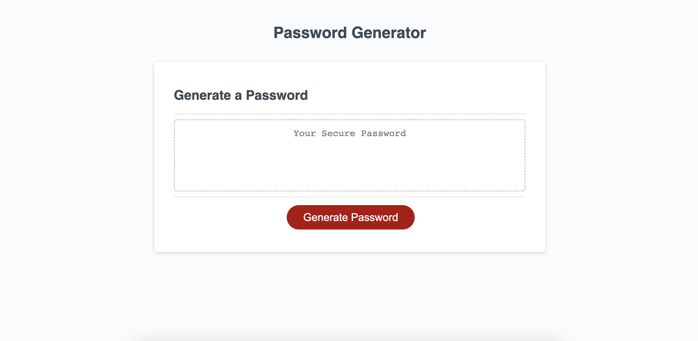

# Password Generator

This is an app that generates password for users.

## Link to Deployed Application

## Description
- I wrote the javascript code to enable the functions of password creation.
- The purpose was to enable users to click the button, answer necessary prompts, and view a newly and randomly created password that meets certain criterion.
- By adding certain prompts, such as password length and characters, it ensures that the password is valid and protected.
- During this process, I gained an understanding for creating multiple functions that perform different tasks in a logical order and also have another function that calls all the different functions to perform a final task, which is to generate a password.

## Installation

N/A

## Usage
- This application allows users who seek a highly protective password to find it instantly.
- The "Generate Password" button triggers different prompts for the users.
- The first prompt lets user choose a number between 8~128.
- The second, third, fourth, and fifth prompt ask the user if they want to add certain character types.
- By clicking on the desired elements and settings, the user is presented with a password in the card.

## Screenshot of the Website

## Credits

N/A

## License

Please refer to the LICENSE in the repo.
